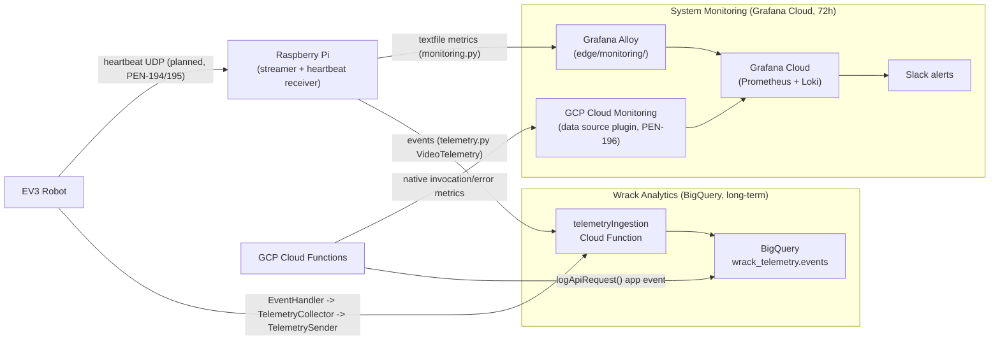

# System Monitoring Architecture

## Overview

This document describes the architecture for real-time operational health monitoring: how metrics and logs get from the EV3, Raspberry Pi, and GCP Cloud Functions into Grafana Cloud, and how that pipeline coexists with the separate analytics pipeline described in [docs/data-tracking/architecture.md](../data-tracking/architecture.md).

It is the technical companion to [docs/monitoring/scope-boundary.md](scope-boundary.md), which covers *which* system a given event or metric belongs to. This document covers *how* it gets there and *why* this technology was chosen.

> **Scope boundary:** This document covers **live monitoring** — Grafana Cloud, 72h retention, Slack alerting. Historical event storage in BigQuery is a separate system; see [docs/data-tracking/architecture.md](../data-tracking/architecture.md).

## Why Grafana Cloud (technology decision)

System Monitoring runs on [Grafana Cloud](https://grafana.com) — Grafana Labs' hosted SaaS (Prometheus/Mimir + Loki + Grafana + alerting), set up in [PEN-189](https://linear.app/pentagram-software/issue/PEN-189/set-up-grafana-cloud-free-account). **It is not a GCP service** — it runs entirely outside Google Cloud, alongside the GCP-hosted Cloud Functions and BigQuery.

It was chosen over the alternative of building monitoring directly on GCP-native tooling because:

- **Bundled free-tier stack**: Prometheus (Mimir), Loki, Grafana, and alert routing come as one hosted product — no separate infrastructure to run or patch on Pi-class hardware.
- **Grafana Alloy** is a single lightweight, ARM-compatible agent binary (`edge/monitoring/alloy/config.alloy`) that can scrape and push both metrics and logs from the Pi with one process, which a GCP-only stack (Cloud Monitoring agent + Cloud Logging agent) does not offer as cleanly for a non-GCE host.
- **Native Slack alerting** is a first-class Grafana Cloud feature ([PEN-199](https://linear.app/pentagram-software/issue/PEN-199/configure-slack-alerting-contact-point-and-alert-rules)), meeting the PRD's "actionable Slack alerts" requirement without custom alerting code.
- **GCP Cloud Monitoring is used, but only as a secondary, read-only data source** — for signals that are already GCP-native and would be redundant to re-emit (see below), not as the monitoring backbone. It has no equivalent for the EV3/Pi push path since those devices aren't GCP resources.

Analytics made the opposite tradeoff for a different problem: BigQuery was chosen for **long-term structured storage, SQL analysis, and ML-readiness** (see the [Technology Alternatives Analysis](../data-tracking/requirements.md#technology-alternatives-analysis)), not for 10-second liveness detection. Trying to serve both needs from one store was rejected — that rejection is the reason this scope boundary exists at all.

## System context — two destinations, one set of sources

## Transport mechanisms (how events reach each destination today)

| Source | → System Monitoring | → Wrack Analytics |
|---|---|---|
| EV3 | UDP heartbeat → Pi-side Prometheus textfile → Alloy push (**planned**, not yet implemented — [PEN-194](https://linear.app/pentagram-software/issue/PEN-194/implement-ev3-micropython-udp-heartbeat-sender)/[PEN-195](https://linear.app/pentagram-software/issue/PEN-195/implement-pi-side-ev3-heartbeat-receiver-and-prometheus-textfile)) | `EventHandler` hook → `TelemetryCollector` → `TelemetrySender` → HTTPS POST → `telemetryIngestion` Cloud Function → BigQuery (implemented, `robot/controller/telemetry/`) |
| Raspberry Pi streamer | `monitoring.py::write_metrics()` writes a Prometheus textfile every `status_interval` (10s) → Alloy scrapes and remote-writes to Grafana Cloud | `telemetry.py::VideoTelemetry.emit_stream_health()` → HTTPS POST → `telemetryIngestion` → BigQuery, same tick |
| Raspberry Pi OS (CPU/mem/temp) | `prometheus.exporter.unix` in Alloy → Grafana Cloud | not tracked — no historical value for raw OS resource samples |
| GCP Cloud Functions | Native GCP Cloud Monitoring invocation/error-rate metrics, **pulled** by Grafana Cloud's GCP data source plugin ([PEN-196](https://linear.app/pentagram-software/issue/PEN-196/connect-gcp-cloud-monitoring-to-grafana-cloud-data-source-plugin)) — no code change needed, this is platform-emitted | `logApiRequest()` in `cloud/functions/index.js` (via `api-telemetry.js`) → BigQuery directly, per-request |

The video streamer is the clearest example of a **dual-emission point**: one `status_interval` tick in `UDPVideoStreamer` calls both `monitoring.py` (textfile → Alloy → Grafana, real-time) and `telemetry.py` (HTTP → BigQuery, historical) with the same underlying numbers, because the data serves both purposes at once (see the `video_stream_health` row in the [scope-boundary examples table](scope-boundary.md#examples-from-each-domain)).

## Decision point: where does a new event or metric go?

At the point a new signal is being wired up, the code-level question is:

- Does it get written as a **Prometheus textfile metric or Loki log line**, scraped/pushed by Grafana Alloy? → System Monitoring.
- Does it get built as an **event object** passed to `TelemetryCollector` / `VideoTelemetry` / `logApiRequest()`, ending up as a BigQuery row? → Wrack Analytics.
- Does it need both (a live gauge *and* a historical record)? → Emit it both ways, following the video streamer pattern above.

The conceptual version of this question (which doesn't require knowing the code) is the decision table in [scope-boundary.md](scope-boundary.md#decision-table) — use that first when scoping a new ticket, then come back here for the concrete wiring pattern.

## Current state vs. proposed future architecture

Today these are **two independent push pipelines** with no shared ingress: Alloy pushes straight to Grafana Cloud using Grafana's own credentials, and telemetry code pushes straight to the `telemetryIngestion` Cloud Function using GCP credentials. The EV3 heartbeat leg of the monitoring path doesn't exist yet (PEN-194/PEN-195 are still Backlog).

[PEN-218](https://linear.app/pentagram-software/issue/PEN-218/replace-grafana-alloy-direct-push-with-unified-ingress-single-cloud-function-per-device-auth-pubsub-routing-to-grafana-vs-bigquery) proposes replacing this with a single unified HTTP ingress: one Cloud Function with per-device auth, where each record is tagged `health` or `event` and routed via Pub/Sub to Grafana Cloud or BigQuery respectively. That would turn the "where does this belong" decision into an explicit routing tag set once at emission time, rather than two separate code paths per source. **This proposal is not yet adopted** — it is a companion architecture ticket, not the current design. This document reflects the dual-pipeline architecture as it exists and is being built today; if PEN-218 is adopted, this section and the diagram above should be updated accordingly.

## References

- [docs/monitoring/scope-boundary.md](scope-boundary.md) — ownership rules, decision table, examples
- [docs/data-tracking/architecture.md](../data-tracking/architecture.md) — Wrack Analytics (BigQuery) architecture
- `edge/monitoring/alloy/config.alloy` — Alloy configuration (Pi-side monitoring push)
- `edge/video-streamer/monitoring.py`, `edge/video-streamer/telemetry.py` — dual-emission example
- `cloud/functions/index.js`, `cloud/functions/api-telemetry.js` — Cloud Function analytics emission
- [PEN-218](https://linear.app/pentagram-software/issue/PEN-218/replace-grafana-alloy-direct-push-with-unified-ingress-single-cloud-function-per-device-auth-pubsub-routing-to-grafana-vs-bigquery) — proposed unified ingress (not yet adopted)
