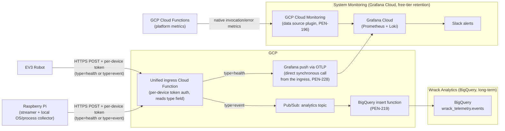

# System Monitoring Architecture

## Overview

This document describes the architecture for real-time operational health monitoring: how metrics and logs get from the EV3 and Raspberry Pi into Grafana Cloud, and how that pipeline coexists with the separate analytics pipeline described in [docs/data-tracking/architecture.md](../data-tracking/architecture.md).

It is the technical companion to [docs/monitoring/scope-boundary.md](scope-boundary.md), which covers *which* system a given event or metric belongs to. This document covers *how* it gets there and *why* this technology was chosen.

> **Scope boundary:** This document covers **live monitoring** — Grafana Cloud, short-lived retention, Slack alerting. Historical event storage in BigQuery is a separate system; see [docs/data-tracking/architecture.md](../data-tracking/architecture.md).

> **Status:** the design below (unified Cloud Function ingress, no direct EV3↔Pi coupling) is the **adopted target architecture**, confirmed in the [PEN-218](https://linear.app/pentagram-software/issue/PEN-218/replace-grafana-alloy-direct-push-with-unified-ingress-single-cloud-function-per-device-auth-pubsub-routing-to-grafana-vs-bigquery) comment thread and in PR review on this doc. Very little of it is built yet — see [Status vs. plan](#status-vs-plan) for what exists today.

## Why Grafana Cloud (technology decision)

System Monitoring runs on [Grafana Cloud](https://grafana.com) — Grafana Labs' hosted SaaS (Prometheus/Mimir + Loki + Grafana + alerting), set up in [PEN-189](https://linear.app/pentagram-software/issue/PEN-189/set-up-grafana-cloud-free-account). **It is not a GCP service** — it runs entirely outside Google Cloud, alongside the GCP-hosted Cloud Functions and BigQuery.

It was chosen over building monitoring purely on GCP-native tooling because:

- **Bundled free-tier stack**: Prometheus (Mimir), Loki, Grafana, and alert routing come as one hosted product.
- **Native Slack alerting** is a first-class Grafana Cloud feature ([PEN-199](https://linear.app/pentagram-software/issue/PEN-199/configure-slack-alerting-contact-point-and-alert-rules)), meeting the PRD's "actionable Slack alerts" requirement without custom alerting code.
- **A hosted OTLP gateway accepts metrics and logs through one protocol**, translating internally into Mimir/Loki. The health-leg push function ([PEN-218](https://linear.app/pentagram-software/issue/PEN-218/replace-grafana-alloy-direct-push-with-unified-ingress-single-cloud)) uses this instead of Prometheus `remote_write` + the Loki push API as two separate integrations — see [the health leg](#the-health-leg-decided) below.
- **GCP Cloud Monitoring is used, but only as a secondary, read-only data source** — for Cloud Functions' own platform metrics (invocation count, error rate), which GCP already emits natively and it would be redundant to re-emit. It is not used for EV3/Pi-originated signals, which aren't GCP resources.

Analytics made the opposite tradeoff for a different problem: BigQuery was chosen for **long-term structured storage, SQL analysis, and ML-readiness** (see the [Technology Alternatives Analysis](../data-tracking/requirements.md#technology-alternatives-analysis)), not for 10-second liveness detection. Trying to serve both needs from one store was rejected — that rejection is the reason this scope boundary exists at all.

**Grafana Alloy is not part of this design.** An earlier plan ran Alloy directly on the Raspberry Pi to scrape and push both Pi OS metrics and streamer health metrics. That's dropped, for two reasons: Alloy is a Linux agent binary and **cannot run on the EV3** at all (Pybricks/MicroPython has no userspace to host it), and running it only on the Pi would have meant either giving the EV3 no monitoring path, or routing EV3 health data through the Pi — which introduces a device-to-device dependency neither device needs today. See [Rejected alternatives](#rejected-alternatives).

## Retention

The PRD's original target was 72h of high-granularity operational data. In practice, retention is whatever Grafana Cloud's plan provides: **14 days on the free tier**, which is a fixed plan floor, not a self-service setting — [PEN-207](https://linear.app/pentagram-software/issue/PEN-207/configure-72h-prometheus-metric-retention-in-grafana-cloud) (Prometheus/Mimir) and [PEN-208](https://linear.app/pentagram-software/issue/PEN-208/configure-72h-loki-log-retention-in-grafana-cloud) (Loki) were both canceled 2026-07-11 after confirming this — shortening retention below the plan default isn't available without upgrading, and the decision is to stay on the free tier.

This doesn't undermine the monitoring/analytics scope boundary in [scope-boundary.md](scope-boundary.md): System Monitoring still isn't treated as a system of record, still isn't queried for historical trends, and nothing depends on data surviving past a few days. The actual retention window is just longer than the original 72h target because of free-tier plan economics, not because the design intent changed. If retention needs tightening later (cost, compliance, or simply wanting the original 72h enforced), revisit by upgrading the Grafana Cloud plan — the qualitative rules in scope-boundary.md's decision table still apply regardless of the exact number.

## Adopted design: unified Cloud Function ingress, routed by record type

Both EV3 and Raspberry Pi push **all** telemetry — health and analytics alike — to one HTTP ingress, authenticated with a lightweight per-device token introduced by [PEN-227](https://linear.app/pentagram-software/issue/PEN-227/implement-unified-ingress-cloud-function-per-device-auth-type-field) (`X-Device-Id` + `X-Device-Token` headers, checked against a `device-tokens` Secret Manager secret) — not the shared static `API_KEY` the older `telemetryIngestion` function used. The ingress function is intentionally thin: authenticate, read a `type` field (`health` or `event`) on each record, and route. It does not talk to Grafana or BigQuery itself.

### Why not the alternatives {#rejected-alternatives}

- **EV3 pushes to Grafana Cloud directly** (no Cloud Function in between): rejected — would mean storing real Grafana credentials on the EV3 brick (and the Pi), for every device. The unified ingress keeps Grafana credentials in exactly one place (the downstream push function), and devices only ever hold a lightweight per-device token (PEN-227) — a new mechanism, not a reuse of the control path's shared `X-API-Key`, which authenticates every caller with one static value rather than scoping a credential per device.
- **EV3 → Pi → Grafana** (Pi relays EV3's health data, e.g. via the previously-planned UDP heartbeat receiver): rejected — introduces a device-to-device network dependency that doesn't exist anywhere else in the system today. Confirmed in PR review: neither device should depend on the other being reachable.
- **Alloy scraping on the Pi for Pi-local metrics only, unified ingress for everything else**: considered, but rejected for consistency — the user's own [PEN-218 triage comment](https://linear.app/pentagram-software/issue/PEN-218) already concluded PEN-192/PEN-193 (Pi system + process metrics) "need a new collection mechanism... just not via Alloy scraping," i.e. Pi's own OS/process health also moves to the same push-to-ingress model, via a small local collector process, rather than keeping two different mechanisms live at once.

### The analytics leg (decided)

Event-tagged records go to a Pub/Sub topic consumed by a dedicated BigQuery-insert function ([PEN-219](https://linear.app/pentagram-software/issue/PEN-219/analytics-leg-pubsub-topic-bigquery-insert-function-for-the-unified)). This leg is deliberately decoupled from the health leg — per the PEN-218 discussion, BigQuery writes benefit from batching (delay-tolerant, cheaper) and should retry hard on failure (losing an analytics event is costlier than missing one health sample), which is a different failure/latency profile than health data.

### The health leg (decided)

**Wire protocol to Grafana Cloud: OTLP** (decided 2026-07-06, see the [PEN-218](https://linear.app/pentagram-software/issue/PEN-218/replace-grafana-alloy-direct-push-with-unified-ingress-single-cloud) comment thread). The push function sends both metrics and logs through Grafana Cloud's hosted OTLP gateway using a single client (e.g. `@opentelemetry/exporter-metrics-otlp-http` + `-logs-otlp-http`), rather than hand-rolling Prometheus `remote_write` (protobuf + snappy encoding, no lightweight JS library) and the Loki push API as two separate integrations. The gateway translates OTLP internally into Mimir (metrics) and Loki (logs) — dashboards and alert rules still query PromQL/LogQL against those stores exactly as before; only the push function's outbound protocol changes. Credentials (OTLP gateway endpoint URL + stack instance ID + a scoped Access Policy token) are provisioned in [PEN-189](https://linear.app/pentagram-software/issue/PEN-189/set-up-grafana-cloud-free-account) and stored via `cloud/monitoring/setup-grafana-secret.sh`.

**Delivery mechanism: direct synchronous push** (decided 2026-07-12, see the [PEN-218](https://linear.app/pentagram-software/issue/PEN-218/replace-grafana-alloy-direct-push-with-unified-ingress-single-cloud) comment thread). The ingress function calls the health-leg push function directly over HTTP rather than publishing to an intermediate Pub/Sub topic. [ingress.js](../../cloud/functions/ingress.js)'s `pushHealthRecords()` processes a batch's health records in chunks of up to 20 concurrent fetches, each bounded by a 3s per-call timeout. A 4s deadline bounds how long the loop keeps *starting new chunks* — it's checked only before each chunk begins, not while one is in flight — so a chunk that starts just under the deadline can still run for its own 3s timeout before returning; any records that would exceed the 4s scheduling deadline entirely are dropped without being attempted (fail open, same as any other health-leg failure). That gives the health leg a ~7s worst case overall (4s scheduling budget + up to 3s for one in-flight chunk), not a hard 4s cap. The health leg runs **concurrently** with the analytics/BigQuery leg via `Promise.all`, not sequentially: the two used to run one after the other, but each has its own multi-second worst case (health's ~7s described above; BigQuery's exponential-backoff retries, ~7s), and summed sequentially that comfortably exceeds both senders' 10s HTTP timeout — the sender would time out and retry a batch the ingress had already accepted. Running them concurrently bounds the overall response time to whichever leg is slower, not their sum.

The Pub/Sub-mediated alternative — a `health` topic symmetric to the analytics leg, consumed by a small pushing function — was considered and explicitly deferred rather than rejected outright: there's no current requirement driving the extra decoupling, and running both legs concurrently with bounded timeouts already keeps a stalled Grafana endpoint's worst case from adding to the analytics leg's — the response still waits on both to finish, but never on their sum. Revisit if that coupling becomes a real operational problem (e.g. Grafana OTLP gateway latency/availability measurably affecting ingress response times, or a need to retry/buffer health records rather than dropping them).

Health push failures fail open (drop and continue) rather than retry hard, unlike the analytics leg. The receiving side of this call is tracked in [PEN-228](https://linear.app/pentagram-software/issue/PEN-228/implement-health-leg-push-function-otlp-push-to-grafana-cloud) — PEN-219 only covers the analytics leg.

**Authenticating the ingress → health-leg call (decided 2026-07-12):** this call currently sends no credential at all — `pushHealthRecord()` issues a bare `fetch()` with no `Authorization` header. That's a real gap: the health-leg function will hold real Grafana OTLP push credentials, so it can't be left as an open, unauthenticated public endpoint the way `controlRobot`/`telemetryIngestion`/`unifiedIngress` are (all three are deployed `--allow-unauthenticated`, per `cloudbuild.yaml`/`package.json`, and rely on their *own* app-level check — API key or per-device token — instead of GCP IAM). Unlike those three, the health-leg function has no external caller to support; it only ever needs to accept calls from `unifiedIngress` itself, which makes GCP's built-in service-to-service authentication the right fit rather than another shared secret:

* Deploy the health-leg function **without** `--allow-unauthenticated`, so GCP's own IAM layer rejects any caller that isn't explicitly granted access.
* Grant `unifiedIngress`'s runtime service account the Cloud Functions/Cloud Run invoker role on the health-leg function (mirrors the existing pattern in `cloudbuild.yaml` that grants `unifiedIngress`'s service account `roles/secretmanager.secretAccessor` on `device-tokens` — an IAM binding added as part of the deploy step, not a credential baked into either function's code).
* `pushHealthRecord()` fetches a Google-signed OIDC identity token scoped to the health-leg function's URL (via the metadata server, or `google-auth-library`'s `GoogleAuth.getIdTokenClient(audience)`) and attaches it as `Authorization: Bearer <token>` on each call.

This needs to land as part of [PEN-228](https://linear.app/pentagram-software/issue/PEN-228/implement-health-leg-push-function-otlp-push-to-grafana-cloud)'s scope — both the IAM grant/deploy flag on the receiving side and the identity-token fetch in `pushHealthRecord()` on the calling side — not as a follow-up hardening pass after the endpoint is already live.

### Dual-homed signals (decided)

Some signals — `video_stream_health` today — need to reach **both** destinations (see the [scope-boundary examples table](scope-boundary.md#examples-from-each-domain)). **Decided (2026-07-12): the device sends two separate records**, one tagged `type: "health"` and one tagged `type: "event"`, rather than the ingress supporting a `type: "both"` that fans out a single record to both topics.

This keeps the routing model at exactly one `type` per record — no fan-out branch in the ingress function, no ambiguity about whether a record's `event_id` refers to one delivery or two. The tradeoff is the sending device does the duplication (two POSTs, or two entries in one batch) instead of the ingress; that's a small cost for a dual-homed signal like `video_stream_health` that isn't expected to be a common case.

## Transport mechanisms (target state)

| Source | → System Monitoring | → Wrack Analytics |
|---|---|---|
| EV3 | HTTPS POST + per-device token, `type=health` (heartbeat/battery/device status) → unified ingress → health leg (OTLP push) → Grafana Cloud | HTTPS POST + per-device token, `type=event` → unified ingress → analytics topic → BigQuery insert fn (PEN-219) → BigQuery |
| Raspberry Pi streamer | Same ingress, `type=health` for `video_stream_health` (sent as its own record — see [dual-homed signals](#dual-homed-signals-decided) above) | Same ingress, `type=event` for `video_stream_start`/`stop`, and a second `type=event` copy of `video_stream_health` alongside the `type=health` one |
| Raspberry Pi OS/process (CPU/mem/temp, streamer liveness) | Local collector process (replacing Alloy) → same ingress, `type=health` | not tracked — no historical value for raw OS resource samples |
| GCP Cloud Functions (platform) | Native GCP Cloud Monitoring invocation/error-rate metrics, **pulled** by Grafana Cloud's GCP data source plugin ([PEN-196](https://linear.app/pentagram-software/issue/PEN-196/connect-gcp-cloud-monitoring-to-grafana-cloud-data-source-plugin)) — no code change, platform-emitted, does not go through the ingress | `logApiRequest()` in `cloud/functions/index.js` (via `api-telemetry.js`) → BigQuery directly — this is already inside a Cloud Function, so it writes directly rather than round-tripping through the ingress |

## Decision point: where does a new event or metric go?

At the point a new signal is being wired up, the code-level question is a single field the device sets, not a choice of code path:

- Tag the record `type: "health"` if it's a live gauge/log line consumed for real-time triage → routed to Grafana Cloud.
- Tag it `type: "event"` if its value is in historical/aggregate analysis → routed to BigQuery.
- If it's genuinely both, send it as two records — one `type: "health"`, one `type: "event"` — per [dual-homed signals](#dual-homed-signals-decided) above.

The conceptual version of this question (which doesn't require knowing the wire format) is the decision table in [scope-boundary.md](scope-boundary.md#decision-table) — use that first when scoping a new ticket, then come back here for the routing mechanics.

## Status vs. plan

Almost none of the above is built yet. What exists today:

- The analytics side of the ingress (`telemetryIngestion` Cloud Function → BigQuery) is implemented and in production use by both EV3 and the Pi streamer — this becomes the `type=event` leg largely as-is.
- `edge/monitoring/alloy/config.alloy` exists in the repo as a prepared config file, but Alloy has never been installed/deployed (PEN-191 is still Backlog) — under this design it won't be; **PEN-191 is superseded**, not just pending.
- `edge/video-streamer/monitoring.py` (Prometheus textfile writer, written for Alloy to scrape) is likewise superseded — the streamer's health metrics need to move to the ingress push model instead.
- No EV3 heartbeat exists in any form yet. The originally-scoped versions of [PEN-194](https://linear.app/pentagram-software/issue/PEN-194/implement-ev3-micropython-udp-heartbeat-sender) (EV3 → UDP) and [PEN-195](https://linear.app/pentagram-software/issue/PEN-195/implement-pi-side-ev3-heartbeat-receiver-and-prometheus-textfile) (Pi-side UDP receiver relaying to a textfile) are **fully superseded**, not just modified — EV3 posts straight to the ingress like every other device, with no Pi involvement at all. This is a step further than the PEN-218 triage comment assumed (it still had the Pi-side receiver surviving as a relay); today's decision rules that out.
- **The unified ingress function is implemented** ([PEN-227](https://linear.app/pentagram-software/issue/PEN-227/implement-unified-ingress-cloud-function-per-device-auth-type-field), `cloud/functions/ingress.js`): per-device auth, `type`-field routing, `type=event` → `bigquery-client.js` (analytics leg is live, ahead of PEN-219's planned Pub/Sub split — it currently inserts directly), `type=health` → a direct synchronous call to `HEALTH_LEG_FUNCTION_URL`, fails open when that URL is unset. EV3/Pi sender config and headers were migrated to match (`robot/controller/telemetry/sender.py`, `edge/vision/telemetry/sender.py`). Both the health leg's wire protocol (OTLP) and its delivery mechanism (direct sync) are decided (see [above](#the-health-leg-decided)), but the health-leg push function itself (PEN-228) does not exist yet, so health records are currently accepted and dropped (logged, fail-open) until it's built.

PEN-218's own comment thread already flags most of the affected System Monitoring backlog (PEN-191, PEN-192, PEN-193, PEN-195, PEN-198–PEN-208) as needing triage once this direction was confirmed. That confirmation has now happened; those tickets still need to be actually reconciled (superseded, rescoped, or left as-is) — this doc doesn't do that itself.

## References

- [docs/monitoring/scope-boundary.md](scope-boundary.md) — ownership rules, decision table, examples
- [docs/data-tracking/architecture.md](../data-tracking/architecture.md) — Wrack Analytics (BigQuery) architecture
- [PEN-218](https://linear.app/pentagram-software/issue/PEN-218/replace-grafana-alloy-direct-push-with-unified-ingress-single-cloud-function-per-device-auth-pubsub-routing-to-grafana-vs-bigquery) — architecture decision + full design rationale (see comments)
- [PEN-219](https://linear.app/pentagram-software/issue/PEN-219/analytics-leg-pubsub-topic-bigquery-insert-function-for-the-unified) — analytics leg (implemented leg of the ingress)
- `cloud/functions/index.js`, `cloud/functions/api-telemetry.js` — existing Cloud Function analytics emission (basis for the `type=event` leg)
- `edge/monitoring/alloy/config.alloy`, `edge/video-streamer/monitoring.py` — superseded Alloy-based approach, kept in the repo for reference until removed
