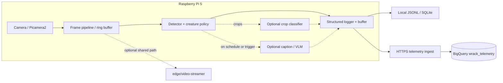

# Edge vision analytics — architecture and plan

This document describes the planned **architecture**, **training approach**, **runtime on Raspberry Pi 5**, and **phased delivery** for image recognition (detection/classification focused on living creatures) and image analysis (structured scene understanding and optional descriptions). It complements the repo root [ARCHITECTURE.md](../../ARCHITECTURE.md) and cloud telemetry layout in [`docs/data-tracking/architecture.md`](../../docs/data-tracking/architecture.md).

## Goals

- Run **local inference** on Raspberry Pi 5 for video from the robot camera context.
- **Detect and characterize** entities with emphasis on **living creatures** (people and animals): labels, confidence, spatial layout, stable IDs when tracking is enabled.
- Emit **structured logs** suitable for replay, aggregation, BigQuery ingestion, and future model improvements.
- Keep **latency and CPU** predictable relative to the existing [`edge/video-streamer/`](../video-streamer/) service.

Non-goals for an initial iteration (unless explicitly added later): real-time cloud-only inference for every frame, medical-grade identification of species, or guaranteed recognition of every animal class without domain-specific training data.

## System context



### Integration points

- **Video**: Same physical camera and ecosystem as [`edge/video-streamer/`](../video-streamer/). Prefer a single capture path or shared frame queue to avoid duplicate full-res decode/encode load.
- **Telemetry**: Vision events should align with the ingestion model in [`docs/data-tracking/architecture.md`](../../docs/data-tracking/architecture.md) (batched HTTPS to Cloud Functions, schema validation, BigQuery `events`).

## Runtime architecture (inference on Pi)

### Stack (recommended default)

- **Language**: Python 3 (consistent with `edge/video-streamer`).
- **Inference**: ONNX models via **ONNX Runtime** on CPU (ARM64); add an accelerator execution provider if hardware (e.g. Hailo, Coral) is adopted later.
- **Vision I/O**: OpenCV / NumPy; optional **tracker** (e.g. ByteTrack, SORT) for persistent `track_id` in logs.
- **Process control**: `systemd` unit(s), config file for model path, input size, target **analysis FPS** (decoupled from camera FPS), thresholds, and endpoints.

### Two-tier “analysis” model

1. **Recognition (detection / classification)**  
   Always-on at a throttled rate (e.g. 2–10 FPS effective). Outputs bounding boxes, class names or tags, confidence, and optional track IDs.

2. **Image analysis (descriptions)**  
   - **Tier A — Structured only**: Build a short `scene_summary` string from detections and coarse geometry (e.g. “person, left; dog, center; high confidence”). No extra neural model.  
   - **Tier B — Learned captions**: Optionally run a small vision–language or captioning model on a **sparse schedule** (every N seconds) or **on triggers** (new creature class, high-confidence animal). Requires hardware headroom and separate training or off-the-shelf weights.  
   - **Tier C — Hybrid cloud**: Optional upload of cropped keyframes for richer captions; not required for core edge logs.

### Creature-centric policy

- Map raw model outputs to a stable vocabulary, for example `CreatureCategory`: `person`, `animal`, `unknown_living`, `not_living`.
- Maintain an **allowlist** of creature-relevant labels (from COCO-style taxonomies or custom heads) plus **confidence thresholds**.
- Optionally add a **second-stage classifier** on detection crops trained on robot-specific negatives (statues, foliage, cables) versus animals/people.

### Log schema (versioned)

Design logs as **events**, not unstructured prose. Suggested fields (evolve with `schema_version`):

| Field | Description |
|--------|-------------|
| `schema_version` | Integer for compatibility |
| `event_type` | e.g. `vision.frame_analysis` |
| `ts_iso` | Device timestamp (ISO 8601) |
| `segment_id` / `session_id` | Correlation with runs or recordings |
| `frame_index` | Optional monotonic index |
| `detections[]` | `label`, `creature_category`, `confidence`, `bbox_norm`, `track_id` |
| `scene_summary` | Short human-readable summary |
| `inference` | `model_id`, `model_version`, `backend`, `latency_ms` |

Store **full detection JSON** locally when debugging; upload **privacy-filtered** subsets if persons are involved.

---

## Training and model development architecture

Training runs **off-device** (workstation or cloud GPU). The Pi runs **exported, quantized** artifacts only.

### 1. Problem framing

| Task | Typical approach | Notes |
|------|------------------|--------|
| **Creature presence / localization** | Object detection (YOLOv8/YOLOv10 family, DETR-exported ONNX, etc.) | Start with pretrained COCO (or similar); filter classes for creatures. |
| **Finer creature typing** | Fine-tune detector or add classifier on crops | Helps local wildlife vs generic “animal”. |
| **Robot-specific false positives** | Fine-tune with hard negatives from your camera | Critical for cluttered environments. |
| **Optional captioning / VLM-lite** | Separate small multimodal model, heavily quantized | Often deferred until detection SLO is met |

### 2. Dataset pipeline

1. **Capture**: Export frames or short clips from Pi (or receivers) representing lighting, blur, vibration, and typical backgrounds. Include **seasonal** and **time-of-day** variety if creatures matter.
2. **Labeling**:  
   - Bounding boxes + class labels for detection.  
   - Optional **attributes** (`occluded`, `distance_bucket`) if useful for analytics.  
   - Use a single **label taxonomy** document checked into the repo or DVC/VCS-compatible store (avoid ad hoc strings).
3. **Splits**: Stratify by scene / lighting; hold out **geo-temporal** blocks if leakage is a risk.

### 3. Training workflow (recommended layout)

Conceptual repos or monorepo subfolder (to be created when implementation starts):

```
edge/vision/
├── README.md                 # This file
├── training/                 # Optional: scripts, configs (when added)
│   ├── configs/              # Hydra/YAML or similar
│   ├── export_onnx.py        # Export + opset check
│   └── evaluate.py           # mAP, creature-specific PR, latency proxy
└── models/                   # Git-LFS or external artifact store — not raw weights in git
```

**Steps:**

1. **Baseline**: Train or fine-tune from a strong pretrained checkpoint on your labeled set (or subset for quick iteration).
2. **Evaluate**: Offline mAP/recall/precision **per creature group** and confusion with non-living lookalikes.
3. **Export**: ONNX with fixed opset; verify with ONNX Runtime on **ARM64** (cross-test or Pi CI device).
4. **Quantization**: INT8 dynamic or QAT where supported; regression-test accuracy **after** quantization.
5. **Version**: `model_id` + semantic `model_version`; record training **config hash**, dataset **version**, and metrics in `MODEL_CARD.md` or experiment tracker.

### 4. Analysis models (captions)

If Tier B captioning is in scope:

- Prefer **frozen** pretrained captioning/VLM checkpoints, then optional **adapter** fine-tuning on pairs `(image_crop, short_description)` from your domain.
- Training objective: constrain length and vocabulary toward **analytics** (“what/where”), not conversational text.
- Always store **structured detections** as ground truth anchor; captions are supplementary for logs.

### 5. Governance and reproducibility

- Treat **datasets** containing faces or private spaces under your privacy policy; restrict sharing and uploads.
- **Model cards**: intended use, known failures, cutoff dates for training data.
- **Rollback**: Ability to deploy previous ONNX + config if a new model regresses on Pi.

---

## Phased delivery plan

| Phase | Focus | Exit criteria |
|-------|--------|----------------|
| **0** | SLOs: resolution, analysis FPS, max latency, privacy rules | Signed-off written brief |
| **1** | Hardware benchmark: 1–2 ONNX detectors on Pi 5 | FPS, CPU, thermal table |
| **2** | `edge/vision` runtime skeleton: config, inference loop, JSONL | Live + file-based demo |
| **3** | Creature policy, tracking optional, Tier A `scene_summary` | Stable creature-centric events |
| **4** | Training pipeline v1: labels, train, export, quantize, evaluate | Versioned model + metrics |
| **5** | Telemetry hookup to Cloud ingestion + BigQuery event type | End-to-end batched upload |
| **6** | Optional Tier B captioning or second-stage classifier | Only if Phase 1–3 headroom confirmed |

---

## Risks and mitigations

| Risk | Mitigation |
|------|------------|
| CPU contention with streaming | Throttle analysis FPS; smaller input; optional accelerator; avoid duplicate encodes |
| Poor generalization to local fauna | Specialist data + fine-tune; open-vocabulary detector as fallback |
| Caption hallucination | Prefer structured logs; rate-limit captions; keep raw detection JSON |
| Telemetry cost | Batch events; cap field sizes; sample low-value frames |

---

## Related documentation

- [ARCHITECTURE.md](../../ARCHITECTURE.md) — system layers and telemetry flow  
- [`docs/data-tracking/architecture.md`](../../docs/data-tracking/architecture.md) — BigQuery ingestion and `edge/vision` placeholder  
- [`edge/video-streamer/README.md`](../video-streamer/README.md) — camera and streaming  

When implementation lands, extend [`shared/telemetry-types/`](../../shared/telemetry-types/) (or equivalent) with vision event types so Python (edge), Cloud Functions, and analytics share one contract.
